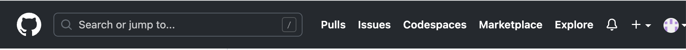
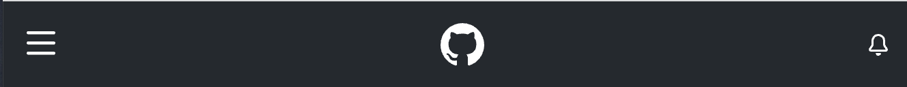
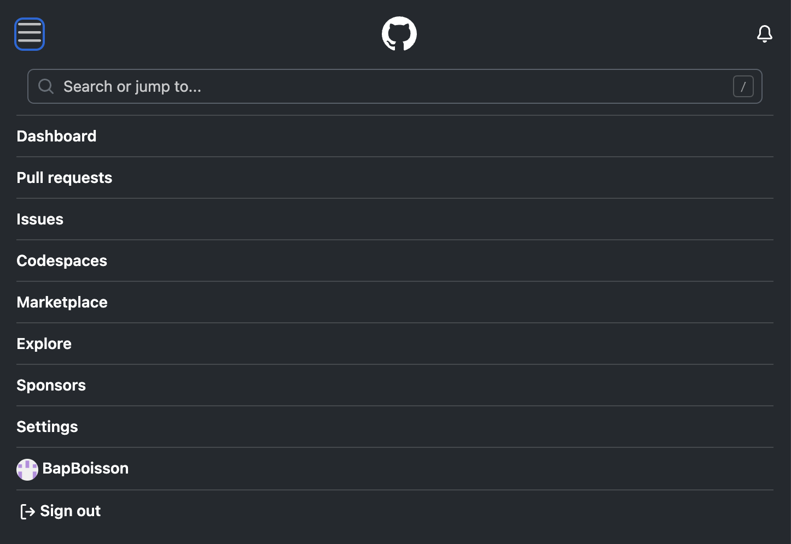

# Sommaire des modules

- [01 - Présentation](./01_Presentation.md)
- [02 - Gestion Connexion](./02_Gestion_Connexion.md)
	- [02A - Gestion Connexion - Section Connexion 42](./02A_Connexion_42.md)
	- [02B - Gestion Connexion - Section Double Authentification](./02B_Double_Authentification.md)
- [03 - Inscription](./03_Inscription.md)
	- [03A - Inscription - Section Vérification Email](./03A_Verification_Email.md)
	- [03B - Inscription - Section Email Vérifié](./03B_Email_Verifie.md)
- [04 - Password Perdu](./04_Password_Perdu.md)
	- [04A - Password Perdu - Section Modification Password Perdu](./04A_Modification_Password_Perdu.md)
- [05 - Terms](./05_Terms.md)
- [10 - Home Connected](./10_Home_Connected.md)
	- [10A - Profil Resumé](./10A_Profil_Resume.md)
	- [10B - Jeu Résumé](./10B_Jeu_Resume.md)
- [11 - Chat](./05_Chat.md)
	- [11A - Home](./11A_Chat_Home.md)
	- [11B - Recherche](./11B_Recherche_Chat.md)
	- [11C - Conversation](./11C_Conversation.md)
	- [11D - Détails Channel](./11D_Details_Channel.md)
	- [11E - Détails User](./11E_Details_User.md)
- [12 - LeaderBoard](./12_LeaderBoard.md)
	- [12A - Overview](./12A_Overview.md)
	- [12B - Leveling](./12B_Leveling.md)
	- [12C - Classic](./12C_Classic.md)
	- [12D - Crunchy](./12D_Crunchy.md)
- [13 - Profil User](./13_Profil_Detail.md)
	- [13A - Edit Profil](./13A_Edit_Profil.md)
	- [13B - Overview](./13B_Overview.md)
	- [13C - Channel List](./13C_Channel_List.md)
	- [13D - Contact List](./13D_Contact_List.md)
- [14 - Profil Channel](./14_Profil_Channel.md)
	- [14A - Create Channel](./14A_Create_Channel.md)
	- [14B - Overview](./14B_Overview.md)
	- [14C - Member List](./14C_Member_List.md)
- [15 - Recherche](./15_Recherche.md)
	- [15A - Recherche Results](./15A_Recherche_Results.md)
- [20 - Game Home](./20_Game_Home.md)
- [21 - Game Matchmaking](./21_Game_Matchmaking.md)
- [22 - Game Classic](./22_Game_Classic.md)
- [23 - Game Crunchy](./23_Game_Crunchy.md)
- [24 - Game Partie Privée](./24_Game_Partie_Privee.md)
- [25 - Game Resultat](./25_Game_Resultat.md)
- [26 - Game Amélioration](./26_Game_Amelioration.md)
- [27 - Game Settings](./27_Game_Settings.md)
- [A00 - Module Générique](./A00_Module_Generique.md)
- [A01 - Définition Password](./A01_Definition_Password.md)
- [A02 - Sélection Avatar](./A02_Selection_Avatar.md)
- [A03 - Download Avatar](./A03_Download_Avatar.md)
- [A04 - Gestion Double Authentification](./A04_Double_Autentification.md)
- [Sommaire API](../API/00_Sommaire_API.md)

# Point Ouvert

# API Liée

# Header

**Inspirartion Ecran Large :**

	

**Inspiration Ecran Réduit :** 

	

	

## General

### **Logo**

> **Action**
- Clic : revenir configuration Home
- Passage : prévoir animation

## Utilisateur Non Connecté

### **Logo**

> **Action**
- Clic : Revenir configuration Home
- Passage : prévoir animation

### **Bouton "Log in"**

> **Affichage**
- justifié à Droite

> **Action**
- Clic : ouverture / fermeture module [Gestion Connexion](./02_Gestion_Connexion.md)
- Passage : prévoir animation

### **Bouton "Sign Up"**

> **Affichage**
- justifié à Droite avant Bouton "Log In"

> **Action**
- Clic : ouverture / fermeture module [Inscription](./03_Inscription.md)
- Passage : prévoir animation
## Utilisateur Connecté

### **Logo**

> **Affichage**
- Grand Ecran : Justiifié à Gauche
- Ecran Réduit : Centré

### **Utilisateur**

> **Affichage**
- justifié à Droite
- Avatar Utilisateur
- Grand Ecran : Username Utilisateur à gauche de l'avatar

> **Action**
- Clic : menu déroulant avec :
	- [Profil](./13_Profil_User.md)
	- [Settings](./13_Profil_User.md) avec modification activé
	- "Log out"
- Passage : prévoir animation

### **Bouton Chat**

> **Affichage**
- Grand Ecran : justifié à Gauche après le Logo
- Ecran Réduit : justifié à Gauche après le bouton Menu

> **Action**
- Clic : Ouverture module chat
- Passage : prévoir animation

### **Menu**
module en lien : 
- [Game](./20_Game_Home.md)
- [LeaderBoard](./12_LeaderBoard.md)
- [Section de Recherche](./15_Recherche.md)

> **Affichage**
- Grand Ecran : afficher chaque section :
	- Game & LeaderBoard à Gauche apres Bouton Chat
	- Section de recherche à Droit avant utilisateur
- Ecran Réduit :
	- bouton + plus menu déroulant
	- Justifié à Gauche
	- Section de Recherche en premier

> **Action**
- Clic : Ouverture module en lien
- Passage : prévoir animation
- Section Recherche : menu déroulant avec les résulats : voir [15 - Recherche](./15_Recherche.md) :
	- Si click sur resultat alors ouvrir lien
	- Si touch entrée alors affichage [15 - Recherche](./15_Recherche.md)

# Main

## General

### **Bouton "Remonter au header"**

> **Affichage**
- En bas à droite de la page
- s'affiche au premier scroll et s'enlève lorsque tout en haut
- ne se superpose pas au footer

> **Action**
	- Clic : revenir au Header
	- Passage : prévoir animation

## Utilisateur Non connecté

Configuration par défaut : [01 - Présentation](./01_Presentation.md)

Module possible tous stand-alone : 

1. [01 - Présentation](./01_Presentation.md)
2. [02 - Connexion](./02_Gestion_Connexion.md)
3. [03 - Inscription](./03_Inscription.md)
4. [04 - Password Perdu](./04_Password_Perdu.md)
5. [05 - Terms](./05_Terms.md)

## Utilisateur connecté

Configuration par défaut : [10 - Home Connected](./10_Home_Connected.md)

Le module chat devra pouvoir s'ouvrir (si la page est assez grande) sur la gauche de l'écran en réduisant la place des autres modules affiché
(voir [Chat](./11_Chat.md))

Module Stand-Alone :
- [01 - Présentation](./01_Presentation.md)
- [05 - Terms](./05_Terms.md)
- [10 - Home Connected](./10_Home_Connected.md)
- [11 - Chat](./11_Chat.md)(Si pas assez de place ou agrandis par utilisateur)
- [12 - Leaderboard](./12_LeaderBoard.md)
- [13 - Profil User](./13_Profil_User.md)
- [14 - Profil Channel](./14_Profil_Channel.md)
- [15 - Recherche](./15_Recherche.md)
- [20 - Game Home](./20_Game_Home.md)

# Footer

**Inspiration :**

	

## General

### Ligne de lien vers module : 

- [About](./01_Presentation.md)
- [Terms](./05_Terms.md)

> **Action**
- Clic : Ouverture module en lien
- Passage : prévoir animation

### Ligne Crédit du site :

> **Affichage**
- L'ensemble sera Centrer
1. Logo
2. Année
3. Nom du site

> **Action**
- Clic : Retour Page Home
- Passage : prévoir animation

## Utilisateur Non connecté

## Utilisateur connecté
Ajouter le lien :
- [Settings](./13_Profil_User.md) avec modification activé