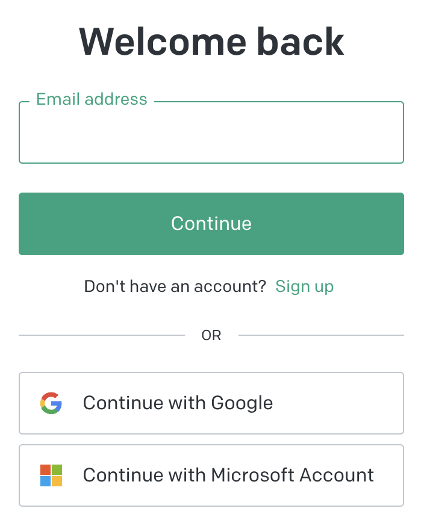

# Module Gestion Connexion

**[Retour Page Inception](./00_Page_Inception.md)**

# Point Ouvert

# API Liée

1. [02 - API Connexion](../API/02_Connexion.md)

# Regle de gestion

**Inspiration:** 

	

	

## Etape 1 : Start Log In

> **Affichage**
- Champ texte "login"
- Bouton "Continue" (si entrée valider ce bouton)
"Don't have an account?" "Sign Up" -> lien [Inscription](./03_Inscription.md)
- Coupe la section avec "Or"
- Bouton de connexion "Login with 42" chargée module [Connexion 42](./02B_Connexion_42.md)

> **Action**
- Chaque lien / bouton doit avoir animation de survol

> **Gestion Erreur**

1. Clic sur continue ou entrée validée sans login : message "please enter a login" :

> **Gestion Succès**
1. Passer à l'étape 2

## Etape 2 : Crunch Log In

> **Affichage**
- Champ texte "login" en conservant texte et bouton "Edit" revenant en arrière
- Champ texte "Password" avec bouton "Oeil" pour voir mot de passe entrée
- "Forgot Password?" -> lien [Password Perdu](./04_Password_Perdu.md)
- Bouton "Continue" (si entrée valider ce bouton)
- "Don't have an account?" "Sign Up" -> lien [Inscription](./03_Inscription.md)

> **Action**
- Chaque lien / bouton doit avoir animation de survol / clic
- Lors de la validation faire appel a l'[API Connexion](../API/02_Connexion.md)

> **Gestion Erreur**
1. Si retour erreur API Connexion :
	- supprimer mot de passe entrée
	- message d'erreur "Wrong Password or Login"

> **Gestion Succès**

- Si option double authentification chargé module [Double Authentification](./02C_Double_Authentification.md)
- Autrement chargé Page Home
