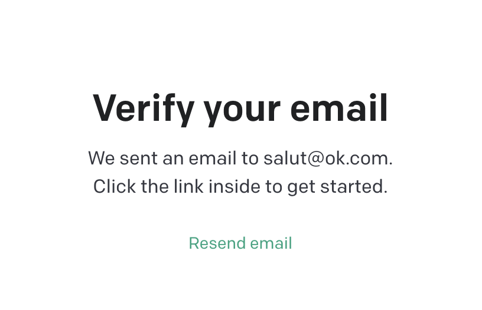

# Module Inscription - Section Vérification Email

**[Retour Page Inception](./00_Page_Inception.md)**

# Point Ouvert

# API Liée
- [04 - API Envoi Verif Email](../API/04_Envoie_Verif_Email.md)
# Regle de gestion

## Inspiration

	

## Etape

> **Affichage**

- Titre "Congrats Very Last Step : Verify your email"
- Texte " We sent an email to [email] Click the link inside to play"
- Bouton "Resend email" -> [04 - API Envoi Verif Email](../API/04_Envoie_Verif_Email.md) :
	- doit attendre 2 minutes avant renvois
- Image avec logo ou jeu

> **Action**

- Au survol / clic prévoir animation sur bouton

> **Gestion Erreur**

> **Gestion Succès**
