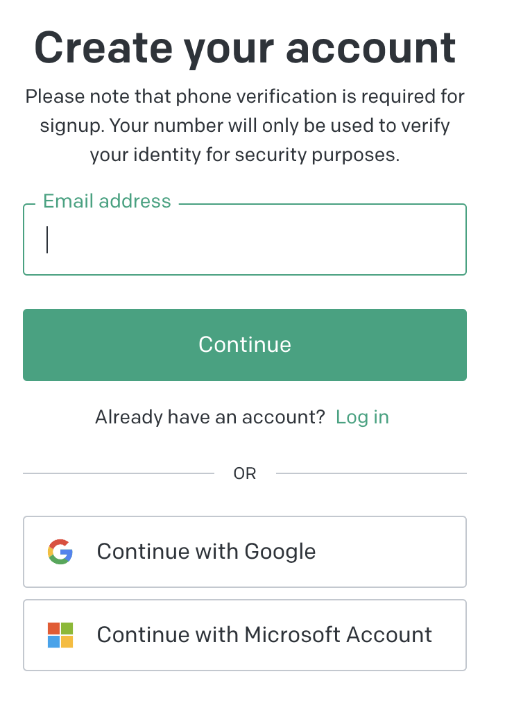

# Module Inscription

**[Retour Page Inception](./00_Page_Inception.md)**

# Point Ouvert

# API Liée
- [03 - API Création Compte](../API/03_Creation_Compte.md)
- [31 - API List User/Channel](../API/31_List_User_Channel.md)
# Regle de gestion

## Inspiration

	

## Etape

> **Affichage**

***1. Inscription Classique :***

Les champs s'afficher les un après les autres si ok (si ecran suffisament grand alors 2 côte à côte):
- Titre "Create Your Account"
- Champ texte "Login" : 
	- icone info : "only for connexion, can't be change, invisible to other user, must be more than 3 characters, cannot be composed of # @ &"
	- non modifiable si debuis 42 OAuth
- Champ texte "Username" :
	- icone info : "visible to other user, cannot be the same as the login, can be change, must be more than 3 characters, cannot be composed of # @ &"
- Champ texte "Nom" :
	- non modifiable si debuis 42 OAuth
- Champ texte "Prénom" :
	- non modifiable si debuis 42 OAuth
- Champ texte "Email" :
	- non modifiable si debuis 42 OAuth
	- Checker si format email valide
- Champ texte "Téléphone" :
	- non modifiable si debuis 42 OAuth
	- Checker si format téléphone valide
- Password :
	- non modifiable si debuis 42 OAuth
	- ajouter le [module Password](./14A_Definition_Password.md)
- Bouton "Confirm"
	- au click ou touche entrée confirmer et envoyée [API 03 - Création Compte](../API/03_Creation_Compte.md)
- "Already have an account?" "Log In" -> lien [Module Connexion](./02_Gestion_Connexion.md)
	- au click ou au click sur la croix du navigateur si un champ remplis afficher box confirmation : 
		- Message "Your inscription will be cancel. Would you proceed?"
		- Bouton "Confirm"
		- Bouton "Back"

***2. Incription avec 42 OAuth :***

- Coupe la section avec "Or"
- Bouton de connexion "Login with 42" chargée module [Connexion 42](./02B_Connexion_42.md)

> **Action**

- Clic bouton "Confirm" ou touche entrée
	- Checker le champ, si erreur (voir gestion erreur) si ok afficher le champ suivant
	- Si tous les champs ok alors envoyée [API 03 - Création Compte](../API/03_Creation_Compte.md)
- Clic bouton "Cancel" ou sur la croix du navigateur afficher box confirmation et blocker modification du reste : 
	- Message "Your inscription will be cancel. Would you proceed?"
	- Bouton "Confirm" -> revenir à la page home
	- Bouton "Back" -> fermer box et permettre modification
- Au survol / clic prévoir animation sur bouton et champ texte

> **Gestion Erreur**

- Pour champ "login" et "username" :
	- minimum 3 charactères (utile pour déclanchement recherche)
	- charactères interdit : # @ &
	- checker si déjà utilisé avec [API 31 - List User/Channel](../API/31_List_User_Channel.md) (attention si login utilisé mais avec 42 OAuth alors c'est ok pour éviter blocage à l'inverse)
- Pour champ "Nom", "Prénom" et "Email" :
	- doivent etre remplis
- Pour champ "Email" :
	- vérifié format donc char @ suive d'un .
- Pour champ "téléphone" :
	- obligatoire si sélection [double authentification](./02B_Double_Authentification.md)

> **Gestion Succès**

- Si l'ensemble est valide passer au module [Vérification d'email](./03A_Verification_Email.md)
