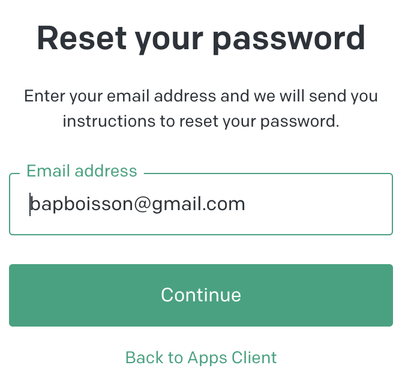

# Module Password Perdu

**[Retour Page Inception](./00_Page_Transcendence.md)**

# Point Ouvert

# API Liée
- [05 - API Envoi Reset Password](../API/05_Envoie_Reset_Password.md)
# Regle de gestion

## Inspiration

	

## Etape

> **Affichage**

- Titre "Reset your password"
- Texte "Enter your login and we will send you instructions to reset your password on your account email"
- champ texte "Login"
- Bouton "Continue"
- Lien "Back to home" -> reviens a la configuration [00 - Home](./00_Page_Inception.md)

> **Action**

- Au survol / clic prévoir animation sur bouton

> **Gestion Erreur**

- Pour champ "Email" :
	- vérifié format donc char @ suive d'un .

> **Gestion Succès**

- Envoyer le lien pour reset avec [05 - API Envoi Reset Password](../API/05_Envoie_Reset_Password.md)
- Message "The email has been send"