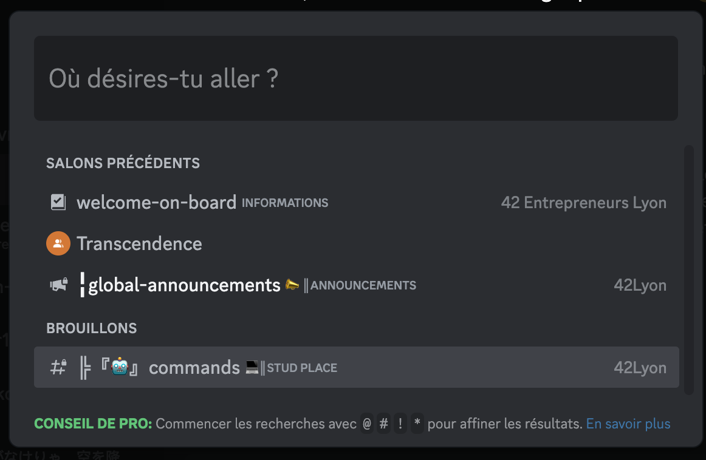

# Module Chat - Section Recherche

**[Retour Page Inception](./00_Page_Inception.md)**

# Point Ouvert

# API Liée
- [API 12 - Join Channel](../API/12_Join_Channel.md)
- [API 13 - Leave Channel](../API/13_Leave_Channel.md)
- [API 25 - Add Contact](../API/25_Add_Contact.md)
- [API 26 - Remove Contact](../API/26_Remove_Contact.md)
- [API 31 - List User Channel](../API/31_List_User_Channel.md)

# Regle de gestion

## Inspiration

	

## Etape

> **Affichage**

- Zone de recherche en haut
- Par défaut texte "Please enter your research (min 3 characters)"
- 2 section avec un bouton à gauche du titre permettant d’ouvrir / réduire la section
- Sur la base des charactères dans le champ recherche (min 3 charactères) récupérer l'ensemble des channels et user corresspondant avec [API 31 - List User Channel](../API/31_List_User_Channel.md) et afficher dans l’ordre suivant  :
	- Section "Channel" :
		- Trié alphabétiquement 
		- Avatar channel
		- Nom Channel
	- Section "User" :
		- trié alphabétiquement 
		- Avatar User
		- Username
- Si aucun resultat message "Sorry no result came for your research"

> **Action**

- Sur la ligne d'une channel / d'un user :
	- Au clic ouverture [Conversation](./11C_Conversation.md) :
		- Si l'utilisateur n'est pas membre de la channel alors avant join avec [API 12 - Join Channel](../API/12_Join_Channel.md)
		- Si le user n'est pas dans la liste de contact de l'utilisateur alors ajouter d'abord aux contacts voir [API 25 - Add Contact](../API/25_Add_Contact.md)
	- Au clic droit ou clic maintenu ou survol sur la droite : afficher menu déroulant d’icone venant de la droite

- Chaque ligne disposera d'un menu déroulant d'icone pour lien vers fonctionnalité : 
	- Section "Channel" :
		- Visage : ouverture [Détails Channel](./11D_Details_Channel.md)
		- Si l'utilisateur n'est pas membre de la channel :
			- Join : rejoindre la channel voir [API 12 - Join Channel](../API/12_Join_Channel.md)
		- Si l'utilisateur est membre de la channel :
			- Settings : ouverture [Gestion Channel](./33_Gestion_Channel.md) avec présélection de cette channel
			- Croix : quitter la channel + box confirmation voir [API 13 - Leave Channel](../API/13_Leave_Channel.md)
	- Section "Contact" :
		- Visage : ouverture [Détails User](./11E_Details_User.md)
		- Si le user n'est pas dans la liste de contact de l'utilisateur : 
			- "Add Contact" : ajout à la la liste de contact voir [API 25 - Add Contact](../API/25_Add_Contact.md)
		- Si le user est dans la liste de contact de l'utilisateur :
			- Raquette : ouverture [Partie Privée](./24_Partie_Privee.md)
			- Croix : enlever de la liste d’amis + box confirmation voir [API 26 - Remove Contact](../API/26_Remove_Contact.md)
			- Main : bloquer user et enlever de la liste d’amis + box confirmation voir [API 26 - Remove Contact](../API/26_Remove_Contact.md)

> **Gestion Erreur**

> **Gestion Succès**

