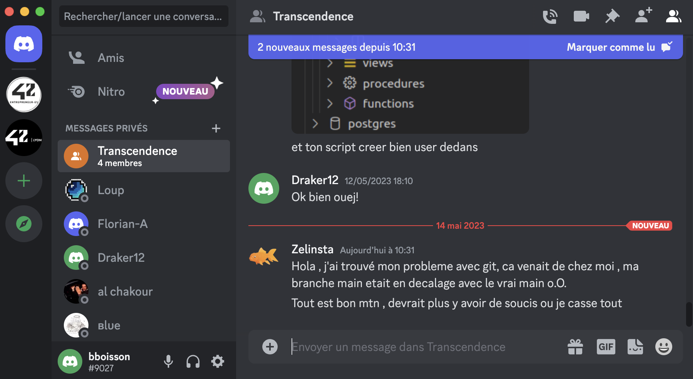

# Module Chat - Section Conversation

**[Retour Page Inception](./00_Page_Transcendence.md)**

# Point Ouvert
- Prévoir system de notification pour :
	- message recu
	- partie privée
	- ...
# API Liée
- [API 13 - Leave Channel](../API/13_Leave_Channel.md)
- [API 14 - Remove Channel Member](../API/14_Remove_Channel_Member.md)
- [API 26 - Remove Contact](../API/26_Remove_Contact.md)
- [API 30 - Message](../API/30_Message.md)
- [API 31 - List User Channel](../API/31_List_User_Channel.md)
# Regle de gestion

## Inspiration

	

## Etape

> **Affichage**

Le module sera composé de 3 partie :
1. **Titre de la conversation :**
- Si conversation Channel :
	- Justifié à Gauche
		- Avatar Channel
		- Nom Channel
	- Justifié à Droite menu d'option avec Visage / Settings / Croix
- Si conversation Privée :
	- Justifié à Gauche
		- Avatar User
		- Nom User
	- Justifié à Droite menu d'option avec Visage / Raquette / Croix / Main

2. **Affichage des Messages :**
- Reçu : Justifié à gauche
- Envoyé : Justifié à droit
- Première ligne : 
	- Avatar User
	- Nom User
	- Date et heure réception
	- Si conversation de channel justifié à droite des messages recu bouton options qui ouvre un menu déroulant d’icone
- Ligne suivante tous les message reçu / envoyé à la suite (sauf si interruption (message d'un autre user) entre temps ou plus de 5 min entre 2 messages)

3. **Envoie des Messages :**
- Champ texte pour écrire avec message info lorsque vide "Send a message..."
- Un bouton pour l’envoie
- Un bouton pour sélectionner des emojis

### Module de gestion
Le module de conversation permettera aussi d'effectuer des actions :
- Si c’est la channel est protégé par password envoyer un message « This channel is password protected. Please enter password : »
	- Si password ok : ajouter user à la channel et annoncer aux autres utilisateurs
	- Si password erroné : message « Incorect password. Please enter password : »
- Message d'invitation à une partie privée avec choix oui / non

> **Action**

1. **Titre de la conversation :**
- Si conversation Channel :
	- L'avatar et le nom de la channel sont un lien vers [Details Channel](./05D_Details_Channel.md)
	- Visage : ouverture [Détails Channel](./11D_Details_Channel.md)
	- Settings : ouverture [Gestion Channel](./33_Gestion_Channel.md) avec présélection de cette channel
	- Croix : quitter la channel + box confirmation voir [API 13 - Leave Channel](../API/13_Leave_Channel.md)
- Si conversation Privée :
	- L'avatar et le nom du user sont un lien vers [Details User](./11E_Details_User.md)
	- Visage : ouverture [Détails User](./11E_Details_User.md)
	- Raquette : ouverture [Partie Privée](./24_Partie_Privee.md)
	- Croix : enlever de la liste d’amis + box confirmation voir [API 26 - Remove Contact](../API/26_Remove_Contact.md)
	- Main : bloquer user et enlever de la liste d’amis + box confirmation voir [API 26 - Remove Contact](../API/26_Remove_Contact.md)

2. **Affichage des Messages :**
- Avatar et Nom User sont un lien vers [Details User](./11E_Details_User.md)
- Si conversation de channel si clic sur bouton options ouverture menu déroulant d’icone venant de la droite :
	- Visage : ouverture [Détails User](./11E_Details_User.md)
	- Raquette : ouverture [Partie Privée](./24_Partie_Privee.md)
	- Si l'utilisateur est Admin / Owner alors : 
		- Croix : kick user de la channel + box confirmation voir [API 14 - Remove Channel Member](../API/14_Remove_Channel_Member.md)
		- Main : ban et kick user de la channel + box confirmation voir [API 14 - Remove Channel Member](../API/14_Remove_Channel_Member.md)

3. **Envoie des Messages :**
- Au clic sur bouton emojis ouverture menu de sélection des emojis

### Module de gestion

> **Gestion Erreur**

> **Gestion Succès**

