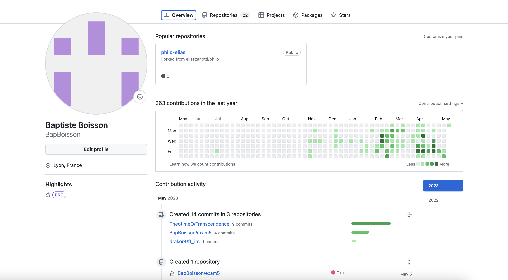
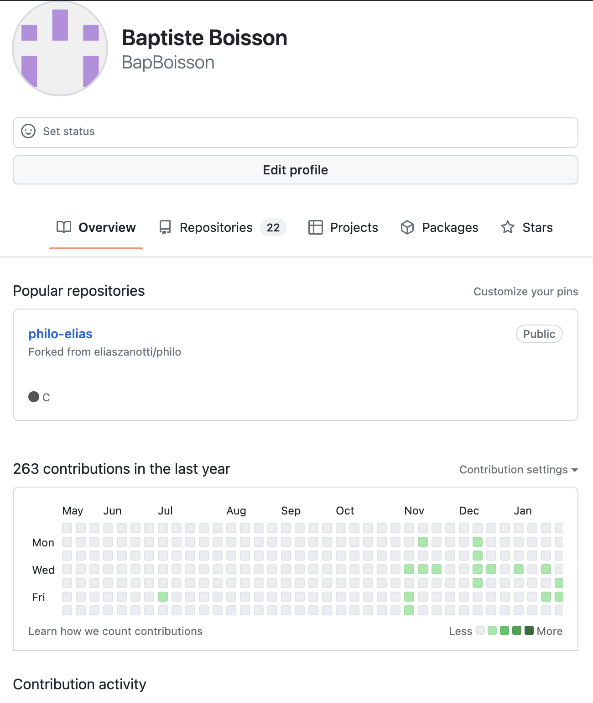

# Module Profil Channel

**[Retour Page Inception](./00_Page_Transcendence.md)**

# Point Ouvert

# API Liée
- [API 11 - Update Channel](../API/11_Update_Channel.md)
- [API 12 - Join Channel](../API/12_Join_Channel.md)
- [API 15 - Info Channel](../API/15_Info_Channel.md)
# Regle de gestion

## Inspiration

	

	

## Etape

> **Affichage**

Le module profil channel doit s'appeler avec le nom d'une channel et l'[API 15 - Info Channel](../API/15_Info_Channel.md)

Il sera composé de 3 partie :
1. **Info Channel** :
	- A gauche si suffisament de place
	- En premier si ecran réduit
	- Avatar Channel :
		- si User est Admin/Owner alors bouton "Change Avatar" en bas à droite de l'avatar
	- Nom Channel
	- Ligne d'icone :
		- Conversation
		- Si le User n'est pas membre de la channel :
			- Join Channel
		- Si le User est membre de la channel :
			- Croix
2. **Menu** permettant de naviguer dans 2 modules : Overview / Members
3. Affichage du **modules** selectionnée, par défaut : Overview

> **Action**

**Info Channel :**
- Si User est Admin/Owner :
	- clic bouton "Change Avatar" : ouverture menu déroulant :
		- "Select Avatar" au clic : ouverture [A02 - Selection Avatar](./A02_Selection_Avatar.md)
		- "Download Avatar" au clic : ouverture [A03 - Download Avatar](./A03_Download_Avatar.md)
	- Nom Channel au clic devient champ texte pour modification avec sous-module [A05 - Define Name](./A05_Define_Name.md) puis à la touche entrée ou clic ailleurs sauvegarde avec [API 11 - Update Channel](../API/11_Update_Channel.md)
- Si l'utilisateur n'est pas membre de la channel : 
	- Conversation : join la channel avec [API 12 - Join Channel](../API/12_Join_Channel.md) puis ouverture [11C - Conversation](./11C_Conversation.md)
	- Join : [API 12 - Join Channel](../API/12_Join_Channel.md)
- Si l'utilisateur est membre de la channel : Settings et Croix
	- Conversation : ouverture [11C - Conversation](./11C_Conversation.md)
	- Croix : quitter la channel + box confirmation voir [API 13 - Leave Channel](../API/13_Leave_Channel.md)

**Menu :**
- Au clic section "Overview" : ouverture [14B - Overview](./14B_Overview.md)
- Au clic section "Members" : ouverture [14C - Channel List](./14C_Member_List.md)

> **Gestion Erreur**

> **Gestion Succès**
