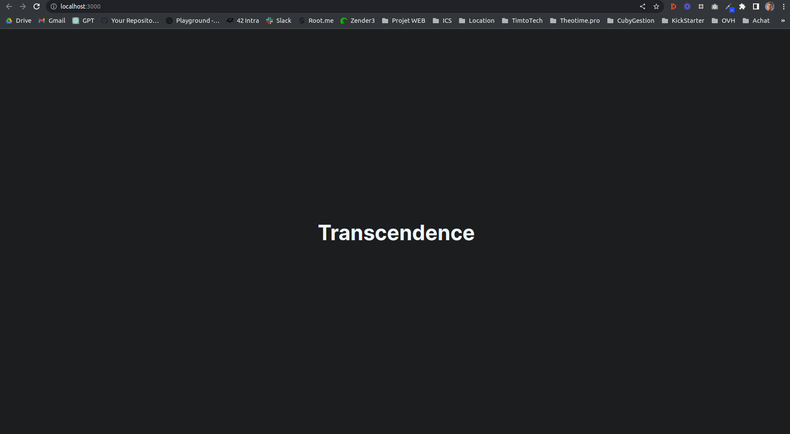
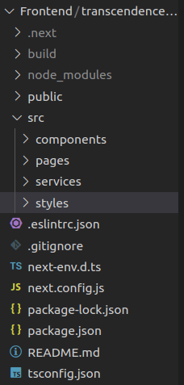
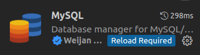
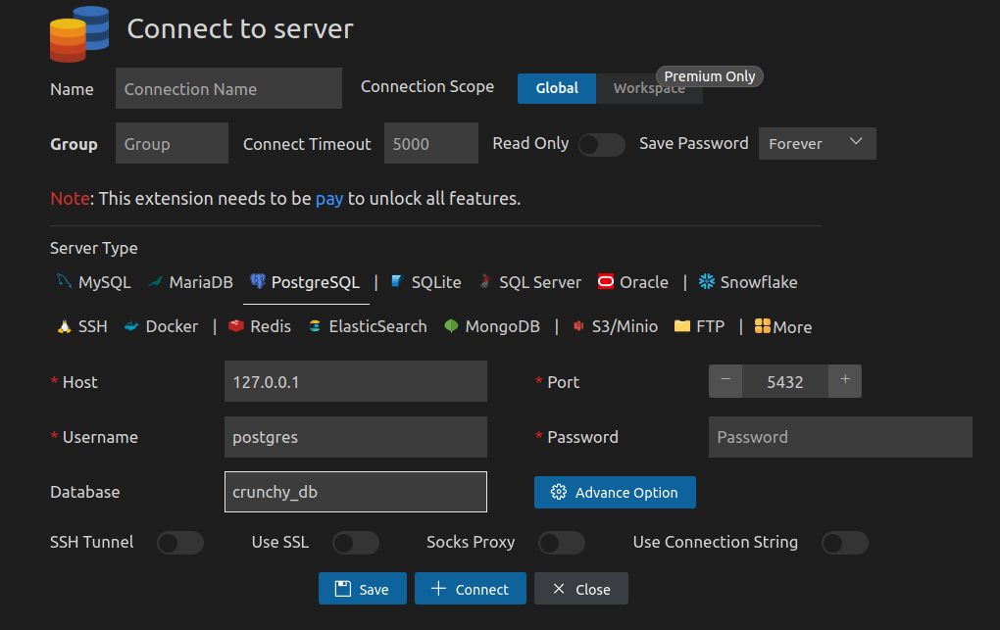
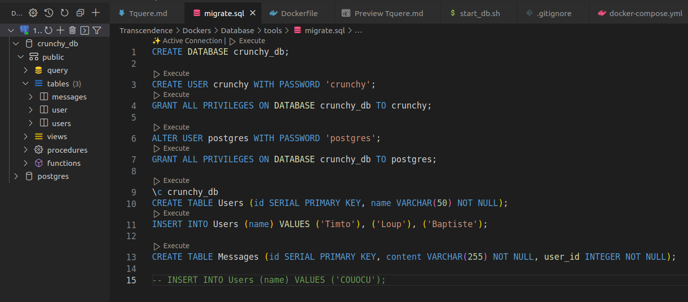
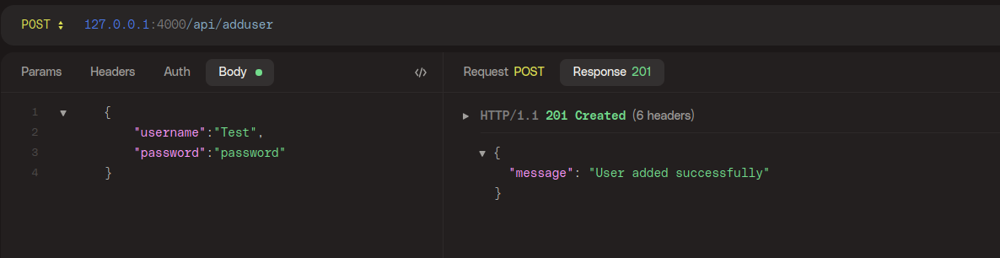
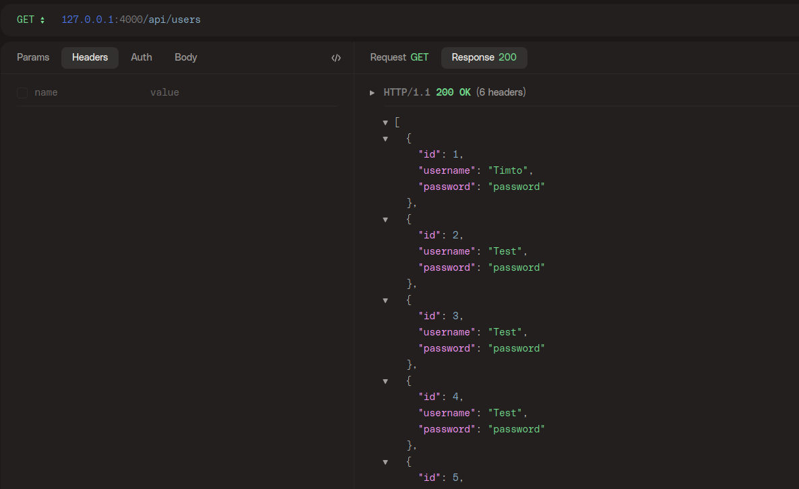
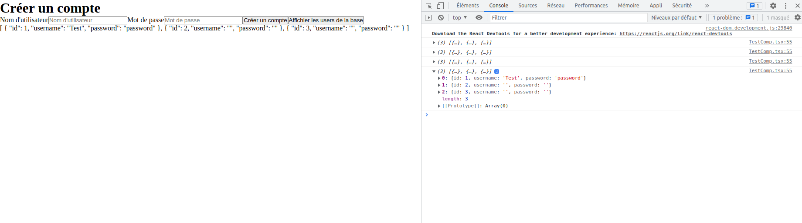

# Ajout du 10/05

- Creation structure projet ( docker , makefile , dossier...)
- Creation du docker pour le frontend avec React

# Ajout du 11/05

- Modification du docker React pour ajouter NextJS

    - React + NextJS

        React : Framwork front avec utilisation de composant reutilisable et REACTif ;)

        NextJS : Framework open-source pour React qui facilite la création d'applications web côté client et côté serveur. Il fournit des fonctionnalités avancées telles que le rendu côté serveur, l'optimisation des performances, le routage côté serveur et la prise en charge des pages statiques et dynamiques.

    - Ecoute sur le port 3000

    - Configuré pour faire des requetes vers le port 4000

    - Ajout configuration de base NextJS et Typescript

    - Pourquoi ajouter NextJS ?

        Ajoute des fonctionalité pour le routage, la structuration du projet , la simplification de l'écriture en React.

- Ajout de code basique dans /Frontend/src a titre d'exemple



## Quelques infos utiles : 

- Tout le code associé au frontend est dans Frontend/transcendence-app

- Seul le contenu du dossier src et public à besoin d'etre modifié, le reste c'est des package et de la configuration pour React , TypeScript et NextJS

- Public contient toutes les ressources utilisées ( icone , favicon , svg..)

<p align="center">
  
</p>

- Le dossier components contient tout les composants que l'on va faire et réutiliser au fur et à mesure ( des composants peuvent contenir d'autres composants ;) )

- Le dossier pages contient les pages de notre projet. Ces pages contiennent nos composants.

- Le dossier services contient des classes utilisées pour stocker des données. Mais elle contiennent surtout toutes les fonctions utilisées pour faire les requettes vers le backend..

- Le dossier styles contient toutes les fichiers css utilisés dans nos pages et nos composants.

- Il existe aussi deux page "_app" et "_document" , c'est la configuration des page par defaut. Attention au modification. Ces pages utilisent le fichier css global.css

# Ajout du 12/05

- Creation du Docker database et configuration

  - Connection en local avec deux user : crunchy crunchy et postgres postgres
  - Test avec creartion d'une table users
  - Creation d'un script executé à chaque redemarage pour creer les tables et les users.

  - Petit soucis de persistance à regler , main demande des permission qui empeche le volume d'etre patagé correctement

  - La database est configuré pour pouvoir comuniqué avec l'exterieur du docker aussi : 

    ```console 
    PGPASSWORD=postgres psql -h 127.0.0.1 -p 5432 -d crunchy_db -U postgres
    ```
  
  - On peut aussi passer par l'extenssion : 

  <p align="center">
    
  </p>

  On se connecte avec les identifiants

  <p align="center">
    
  </p>

  Un fois connecté on peut gerer la database et la visualiser / executer des script dedans

  <p align="center">
    
  </p>


# Ajout du 14/05

  - Creation d'un page /test pour tester la connection avec la database et les requettes backend

  - Creation d'un controller UserController et UsersController pour departager les action sur un user et sur tout les users

  - Creation d'un service UsersService et UserService pour gerer les requettes sur les user

  - Creation d'une route GET /api/users pour recuperer tout les users
  - Creation d'une route POST /api/adduser pour ajouter un user

  - Test des route -> OK
  <p align="center">
    
  </p>

  - Test de la connection avec la database -> OK
  <p align="center">
    
  </p>

  - Test de connection front avec back -> OK
    <p align="center">
    
  </p> 

  - RESTE A FAIRE : 
      
      Ajouter les mdp et user dans .env et conf la bdd avec

      Rendre la db persistente